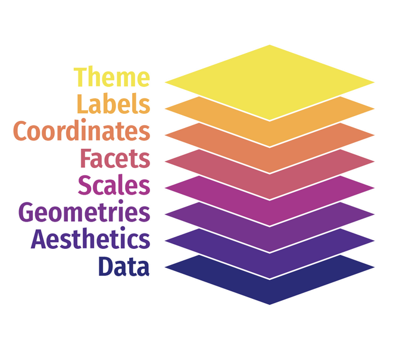

```{r setup, include=FALSE}
knitr::opts_chunk$set(
  echo    = TRUE,
  eval    = FALSE,
  comment = "#>",
  message = FALSE,
  warning = FALSE
)
```

background-color: #1a1a2e
class: middle

.badge[Ayudantía 03 · FAGOB 2026]

# Análisis descriptivo, bivariado y gráficos

.divider[]

**Métodos Cuantitativos para la Administración Pública**

.muted[
Cristóbal Mejías &nbsp;·&nbsp; Facultad de Gobierno
Jueves 10 de abril, 2026
]

---

## Agenda de hoy

.col-izq[
**¿Qué haremos?**

1. Cargar datos procesados de AY-2
2. Tablas de frecuencia con `dplyr` + `kableExtra`
3. Estadísticos descriptivos por grupo
4. Alternativas rápidas (`janitor`, `sjmisc`, `stargazer`)
5. Gráficos con `ggplot2`
6. Práctica autónoma
]

.col-der[
.caja-info[
**Duración:** 90 minutos

**Al final de la sesión:**
Sabrás generar tablas formateadas y gráficos listos para reportar — usando directamente la base procesada en AY-2.
]
]

---

background-color: #e94560
class: center, middle, white

# 00
# Punto de partida

---

## ¿Qué hicimos en AY-2?

- Seleccionamos y renombramos variables con `select()`
- Recodificamos y convertimos a `factor` con `mutate()` + `recode()`
- Tratamos los valores especiales (-88, -99) como `NA`
- Creamos tramos con `case_when()` e `if_else()`
- Guardamos la base procesada con `saveRDS()`

--

.caja[
**Hoy retomamos desde ahí.** Cargamos `casen_proc.rds` y aprendemos a **describir, cruzar y visualizar** sus variables.
]

---

## Paquetes de hoy

```{r paquetes}
pacman::p_load(
  tidyverse,    # colección de paquetes para manipulación de datos
  dplyr,        # para manipular datos (group_by, summarise...)
  janitor,      # para tablas rápidas de frecuencia (tabyl)
  knitr,        # para renderizar y crear tablas (kable)
  kableExtra,   # para formatear tablas (kable_classic, footnote...)
  ggplot2,      # para gráficos (barras, boxplot, dispersión)
  stargazer,    # para estadísticos descriptivos en formato tabla
  sjmisc        # para tablas de frecuencia con etiquetas (frq)
)

options(scipen = 999) # desactivar notación científica
rm(list = ls())       # limpiar ambiente de trabajo
```

---

## Cargar la base procesada

```{r cargar}
# Opción 1: si tienes el archivo en tu carpeta output/
casen_proc <- readRDS("output/casen_proc.rds")
```

```{r cargar-url}
# Opción 2: directamente desde GitHub
url_casen <- "https://raw.githubusercontent.com/Cristobal-Mejias-G/Clase-2-MC-FAGOB/main/output/casen_proc.rds"
tmp <- tempfile(fileext = ".rds")
download.file(url_casen, tmp, mode = "wb")
casen_proc <- readRDS(tmp)
```

```{r explorar}
# Primera mirada
glimpse(casen_proc)
names(casen_proc)
```

.muted[
`mode = "wb"` es clave para archivos binarios como `.rds`. Sin él, el archivo se descarga corrupto.
]

---

background-color: #e94560
class: center, middle, white

# 01
# Tablas de frecuencia

---

## La lógica de las tablas en R

Para generar una tabla bien presentada necesitamos **dos pasos**:

| Paso | Herramienta | ¿Para qué? |
|------|------------|-----------|
| 1. Procesar | `dplyr` | Calcular frecuencias, medias, porcentajes... |
| 2. Formatear | `kableExtra` | Agregar estilo, título y nota al pie |

.caja-info[
El objeto intermedio (ej. `tab_pobreza`) **separa el procesamiento del formato**. Esto permite reutilizar los datos y mantener el código más limpio.
]

---

## Paso 1: procesar con `dplyr`

```{r tab-pobreza}
tab_pobreza <- casen_proc %>%
  dplyr::group_by(pobreza) %>%
  dplyr::summarise(n = n()) %>%
  dplyr::mutate(prop = round(n / sum(n) * 100, 2))

tab_pobreza
```

.muted[
`group_by()` agrupa los datos, `summarise()` cuenta, `mutate()` calcula el porcentaje sobre el total.
]

---

## Paso 2: formatear con `kableExtra`

```{r tabla1}
tabla1 <- tab_pobreza %>%
  kableExtra::kbl(
    align     = "c",
    col.names = c("Situación de pobreza", "N", "%"),
    caption   = "Tabla 1. Distribución por situación de pobreza"
  ) %>%
  kableExtra::kable_classic(full_width = FALSE, position = "center", font_size = 14) %>%
  kableExtra::footnote(general       = "Fuente: Elaboración propia en base a CASEN 2024.",
                       general_title = "")
tabla1
```

.caja[
**Opciones clave de `kbl()`**
- `col.names`: renombra columnas visibles en la tabla
- `caption`: título de la tabla
- `align`: alineación de celdas (`"c"`, `"l"`, `"r"`)
]

---

## Alternativa rápida: `janitor::tabyl()`

```{r tabyl}
casen_proc %>%
  janitor::tabyl(pobreza, sexo) %>%
  kableExtra::kable(caption = "Tabla rápida: pobreza según sexo") %>%
  kableExtra::kable_styling(full_width = TRUE)
```

--

```{r frq}
# sjmisc::frq() — frecuencias con etiquetas tipo haven
sjmisc::frq(casen_proc$pobreza)
sjmisc::frq(casen_proc$sexo)
```

.caja-info[
`tabyl()` y `frq()` son útiles para **exploración rápida**. Para el reporte final conviene el pipeline `dplyr` + `kableExtra`, que da más control sobre el formato.
]

---

background-color: #e94560
class: center, middle, white

# 02
# Estadísticos descriptivos por grupo

---

## El mismo patrón: procesar → formatear

Para variables **numéricas** cruzadas con una **categórica**, ampliamos el `summarise()`:

```{r tab-ingreso}
tab_ingreso <- casen_proc %>%
  dplyr::group_by(sexo) %>%
  dplyr::summarise(
    n       = n(),
    min     = min(ingreso, na.rm = TRUE),
    max     = max(ingreso, na.rm = TRUE),
    media   = round(mean(ingreso, na.rm = TRUE), 0),
    sd      = round(sd(ingreso, na.rm = TRUE), 0),
    mediana = median(ingreso, na.rm = TRUE)
  )
```

.muted[
`na.rm = TRUE` es obligatorio en variables con NA — sin él la función devuelve `NA` sin error ni advertencia.
]

---

## Formatear tabla de descriptivos

```{r tabla2}
tabla2 <- tab_ingreso %>%
  kableExtra::kbl(
    align       = "c",
    col.names   = c("Sexo", "N", "Mínimo", "Máximo", "Media", "DS", "Mediana"),
    caption     = "Tabla 2. Ingreso laboral según sexo",
    format.args = list(big.mark = ".", decimal.mark = ",")
  ) %>%
  kableExtra::kable_classic(full_width = FALSE, position = "center", font_size = 14) %>%
  kableExtra::footnote(general       = "Fuente: Elaboración propia en base a CASEN 2024.",
                       general_title = "")
tabla2
```

.muted[
`format.args = list(big.mark = ".")` agrega el punto de miles en los números (1.200.000 en vez de 1200000).
]

---

## El mismo patrón con otra variable de agrupación

```{r tabla3}
tab_ingreso_edad <- casen_proc %>%
  dplyr::group_by(tramo_edad) %>%
  dplyr::summarise(
    n       = n(),
    media   = round(mean(ingreso, na.rm = TRUE), 0),
    sd      = round(sd(ingreso, na.rm = TRUE), 0),
    mediana = median(ingreso, na.rm = TRUE)
  )

tabla3 <- tab_ingreso_edad %>%
  kableExtra::kbl(
    align     = "c",
    col.names = c("Tramo etario", "N", "Media", "DS", "Mediana"),
    caption   = "Tabla 3. Ingreso laboral según tramo etario"
  ) %>%
  kableExtra::kable_classic(full_width = FALSE, position = "center", font_size = 14) %>%
  kableExtra::footnote(general = "Fuente: Elaboración propia en base a CASEN 2024.",
                       general_title = "")
tabla3
```

---

## Alternativa rápida: `stargazer`

```{r stargazer}
stargazer::stargazer(
  as.data.frame(casen_proc),
  type         = "text",
  summary.stat = c("mean", "sd", "min", "max")
)
```

.caja-info[
**`stargazer` requiere `as.data.frame()`** porque no acepta tibbles directamente.

Usa `type = "text"` para la consola y `type = "html"` al trabajar en Quarto.
]

---

background-color: #e94560
class: center, middle, white

# 03
# Gráficos con `ggplot2`

---

<div style="text-align: center;">
  
</div>


---

## La lógica de `ggplot2`: capas

Todo gráfico en `ggplot2` se construye sumando **capas**:

| Capa | Función | ¿Para qué? |
|------|---------|-----------|
| 1. Datos y ejes | `ggplot(data, aes(...))` | El lienzo |
| 2. Geometría | `geom_*()` | La forma (barras, puntos, cajas...) |
| 3. Etiquetas | `labs()` | Títulos, ejes, leyenda |
| 4. Estética | `theme_*()` | El estilo visual |

.caja[
Las capas se encadenan con `+`. El orden importa: primero datos, luego geometría, luego ajustes.
]

---

## Gráfico de barras: frecuencia de una variable

```{r graf-barras}
ggplot(data    = casen_proc,
       mapping = aes(x = pobreza, fill = pobreza)) +  # CAPA 1: Datos y ejes
  geom_bar() +                                        # CAPA 2: Geometría
  labs(
    title   = "Distribución por situación de pobreza",
    x       = "Situación de pobreza",
    y       = "Frecuencia",
    caption = "Fuente: Elaboración propia en base a CASEN 2024."
  ) +                                                 # CAPA 3: Etiquetas
  theme_minimal() +                                   # CAPA 4: Estilo
  theme(legend.position = "none") +
  scale_fill_manual(values = c("Pobreza severa"            = "#d73027",
                               "Pobreza por ingresos"      = "#f46d43",
                               "Pobreza multidimensional"  = "#fdae61",
                               "No pobre"                  = "#4575b4"))
```

.muted[
`scale_fill_manual()` permite asignar colores específicos a cada categoría.
]

---

## Barras agrupadas: dos variables categóricas

```{r graf-agrupado}
ggplot(casen_proc, aes(x = tramo_ingreso, fill = sexo)) +
  geom_bar(position = "dodge") +                         # separa las barras por grupo
  scale_fill_manual(values = c("darkblue", "steelblue")) +
  labs(
    title = "Distribución de tramo de ingreso según sexo",
    x     = "Tramo de ingreso",
    y     = "Frecuencia",
    fill  = "Sexo"
  ) +
  theme_light()
```

.caja-info[
`position = "dodge"` separa las barras lado a lado.  
`position = "fill"` las apila al 100% — útil para comparar proporciones.
]

---

## Boxplot: distribución de variable continua por grupo

```{r graf-boxplot}
casen_proc %>%
  dplyr::filter(!is.na(ingreso)) %>%              # eliminar NAs antes de graficar
  ggplot(aes(x = sexo, y = ingreso, fill = sexo)) +
  geom_boxplot(alpha = 0.7) +
  scale_y_continuous(
    labels = scales::dollar_format(prefix = "$", big.mark = ".")
  ) +
  labs(
    title = "Ingreso laboral según sexo",
    x     = "Sexo",
    y     = "Ingreso ($)"
  ) +
  theme_minimal() +
  theme(legend.position = "none")
```

.muted[
`filter(!is.na(...))` antes del `ggplot()` evita la advertencia de filas eliminadas. `alpha` controla la transparencia (0 = transparente, 1 = sólido).
]

---

## Dispersión con línea de tendencia

```{r graf-dispersion}
ggplot(casen_proc %>% dplyr::filter(!is.na(ingreso)),
       aes(x = edad, y = ingreso)) +
  geom_point(alpha = 0.2) +                              # puntos semitransparentes
  geom_smooth(method = "lm", se = TRUE, color = "steelblue") + # recta + IC 95%
  labs(
    title = "Relación entre edad e ingreso laboral",
    x     = "Edad",
    y     = "Ingreso laboral ($)"
  ) +
  theme_minimal()
```

.caja[
`geom_smooth(method = "lm")` agrega la recta de regresión lineal con su intervalo de confianza al 95%.

`alpha = 0.2` es útil cuando hay muchos puntos solapados — hace visible la densidad.
]


---

## Mega guía

Ver R for Data Science (2e): https://r4ds.hadley.nz/data-visualize.html

Ver GGPLOT2: https://ggplot2.tidyverse.org/index.html

Podrán encontrar sobre visualización y R.


---

background-color: #e94560
class: center, middle, white

# 04
# Práctica autónoma

---

## Tu turno (10 min)

Con `casen_proc`, trabaja con las variables **`actividad`**, **`tramo_edad`** e **`ingreso_pc`**.

**Instrucciones:**

1. Genera una **tabla de frecuencias** de `actividad` con `dplyr` + `kableExtra`  
   Debe incluir N, porcentaje, título y nota al pie.

2. Genera una **tabla de estadísticos descriptivos** de `ingreso_pc` por `tramo_edad`  
   Reporta: n, media, sd y mediana.

3. Genera un **boxplot** de `ingreso_pc` según `actividad`.

.caja-info[
Usa como modelo los bloques que vimos hoy. El patrón es siempre el mismo: **procesar con `dplyr`** → **formatear con `kableExtra`** → **graficar con `ggplot2`**.
]

---

## Resumen de la sesión

| Tarea | Función(es) | ¿Para qué? |
|-------|------------|-----------|
| Cargar datos | `readRDS()` | Retomar base procesada en AY-2 |
| Frecuencias | `group_by()` + `summarise()` + `kbl()` | Tabla de distribución |
| Descriptivos por grupo | `group_by()` + `summarise()` | Medias, SD, mínimo, máximo |
| Formateo | `kable_classic()`, `footnote()` | Estilo y nota al pie |
| Rápida exploración | `tabyl()`, `frq()`, `stargazer()` | Vista rápida sin mucho código |
| Barras | `geom_bar()` | Frecuencias de variables categóricas |
| Boxplot | `geom_boxplot()` | Distribución de variable continua por grupo |
| Dispersión | `geom_point()` + `geom_smooth()` | Relación entre dos variables numéricas |

---

.badge[Ayudantía 03 · FAGOB 2026]

# ¡Nos vemos en la siguiente sesión!

.divider[]

**AY-4 · 17 de abril**
Documentos dinámicos con Quarto

.muted[
Cristóbal Mejías &nbsp;·&nbsp; Facultad de Gobierno
]
